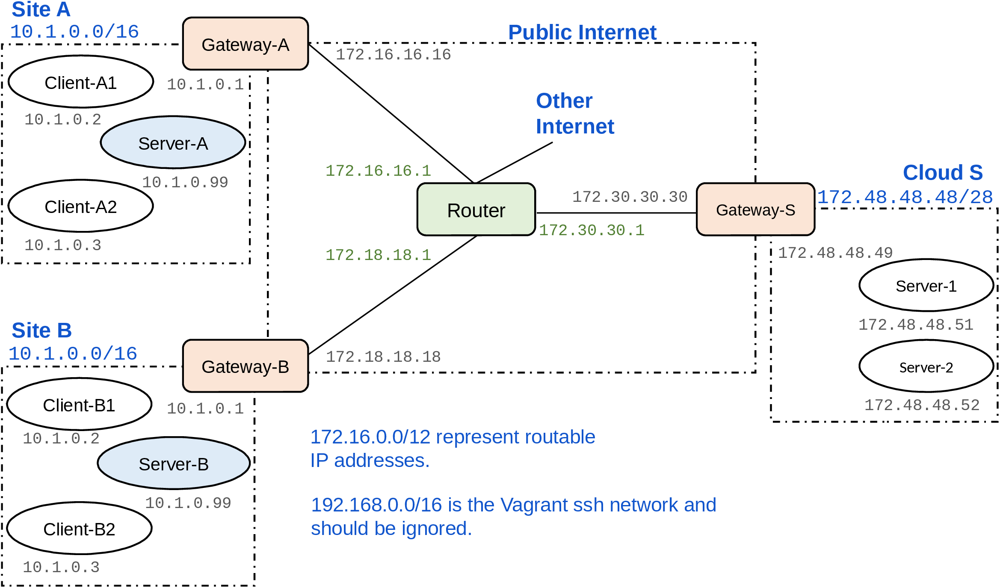

###### CS-E4300 Network Security, Aalto University 2022-2023

### Virtual network environment for student projects

_Authors: Tuomas Aura, Aleksi Peltonen, Thanh Bui_

This project contains a testbed network setup for _Vagrant_ and _VirtualBox_. The testbed is intended for a specific course project at _Aalto University_, but it has been used in research for other experiments.

## Network Overview



The testbed is initially configured so that the clients (IoT devices) in each customer’s network access a local server. Your goal is to relocate the server functionality from the customers’ local networks to a cloud platform, which is represented by the network on the right-hand side. The Router in the above topology represents routing across the Internet between the customer sites and the cloud. The project will mostly require configuring VPN connections and firewall rules on the gateway routers. See the project instructions provided in the course.

Each element of the testbed (i.e. client, server, gateway router is a separate VM that is created based on the base VM. The linked clone VMs are quite memory efficient, and the amount of available memory should not be an issue. The process for creating the testbed will be explained below.

The customer's local network uses the private IP address range 10.1.0.0/16. The client gateways have NATs. The cloud-side gateway, on the other hand, is currently a simple gateway router with no NAT or even firewall configured. The address space 172.16.0.0/12 simulates public, routable IPv4 addresses (even though it really is a private address range). The cloud servers in this case are configured with routable IP addresses. This way, the clients can start communication with the data center, but not the other way around. You may want to change this so that the cloud servers are in a private address space, both for better security and to save on IPv4 addresses.

The Router VM simulates the public Internet between the sites. It also provides a connection to the real Internet, which is needed for downloading software. To enable the routing, you need to start at minimum the client or server VM, the corresponding gateway VMs, and the Router VM. Then, connections from the client or server VM will be routed to the real Internet via the Router.

The Vagrant network (interface _enp0s3_ on each host, IP addresses 192.168.0.0/16) can be mostly ignored. It exists to enable admin access to the VMs with _vagrant ssh_. However, when you modify routing tables, you may want to check with ```route -n``` that this interface does not accidentally become the default gateway on any node. All connections between sites and to the real Internet should be routed via the Router VM.

## Client and Server Apps

In each customer site, i.e. IoT client network, there is one VM (S) with the IP address 10.1.0.99 that currently acts as the local server. The server app is placed in the VM at _/home/vagrant/server-app_ on the server. It is written in NodeJS. Use _vagrant ssh_ to connect to the server VM, go to the server app directory, and run ```npm start``` to start the server. Once it is started, it listens on port 8080 for HTTP requests. Similarly, the client app is placed inside each client VM at _/home/vagrant/client-app_. When you start the client app, it tries to send requests to the local server once a second. You can edit the configuration file _config.json_ to change the server address, e.g. to send the requests to a cloud server. You may  modify client and server app and their configuration as needed for moving the server functionality to the cloud, but one goal is to keep the changes relatively small.

## Network Setup

1. Download and install the latest version of [Vagrant](https://www.vagrantup.com/docs/installation).

The project has been tested with vagrant version 2.3.4 and VirtualBox versions 6.1.40 and 7.0.4.

If you already have VirtualBox installed, you might have to update Vagrant's plugin for VirtualBox guest additions (vagrant-vbguest):
```
vagrant plugin update
```

2. Initialize base VM (only once)

The commands for building the base VM are provided in a simple Makefile (for Linux) and PowerShell script (for Windows). If the scripts do no work on your computer, simply run the commands manually. You only need to build the base VM once.

Linux:

```bash
cd base
./create.sh
```

Windows PowerShell:

```
cd base
.\create.ps1
```

3. Initialize the other VMs:

```bash
cd ..
vagrant up
```

### Useful Vagrant commands

Initialize a specific VM or all VMs:

```bash
vagrant up [vm]
```

SSH into VM:

```bash
vagrant ssh [vm]
```

Halt and restart one VM or all VMs:

```bash
vagrant halt [vm]
vagrant up [vm]
```

Start from the beginning by destroying and recreating the VMs. *Write you configuration as scripts that can be easily rerun on clean VMs. Do not rely on any VM state that is lost during VM restart or reset!*

```bash
vagrant destroy -f
vagrant up
```

Destroy and recreate one VM or all VMs:

```bash
vagrant destroy [vm]
vagrant up [vm]
```

### Useful commands on guest VMs

```bash
ip a
route -n
ping 172.16.16.16
traceroute -n 172.30.0.11
netcat -l -p 33445
netcat 172.48.48.51 33445
sudo tcpdump -i enp0s8
sudo iptables -L
sudo iptables-save
sudo iptables-save > /etc/iptables/rules.v4
sudo ipsec statusall
sudo ip xfrm policy
sudo ip xfrm state
sudo tcpdump esp
sudo conntrack -L
```
## Useful files on guest VMs

```bash
/etc/ipsec.conf
/etc/ipsec.d/
/etc/ipsec.secrets
/etc/iptables/rules.v4
/var/log/syslog
```

## What should you modify?

You should package your project solution to a small number of scripts and configuration files.

You can make changes to the configuration scripts on the _scripts/_ folder. However, do not modify _router.sh_ because the Router simulates the public Internet, which you are not able to reconfigure.

Additionally, you may want to change the cloud network to use a private IPv4 address space. It may be easiest to modify the IP addresses in _Vagrantfile_. Avoid making other changes to _Vagrantfile_. It is not strictly forbidden, though, if technically justified.
